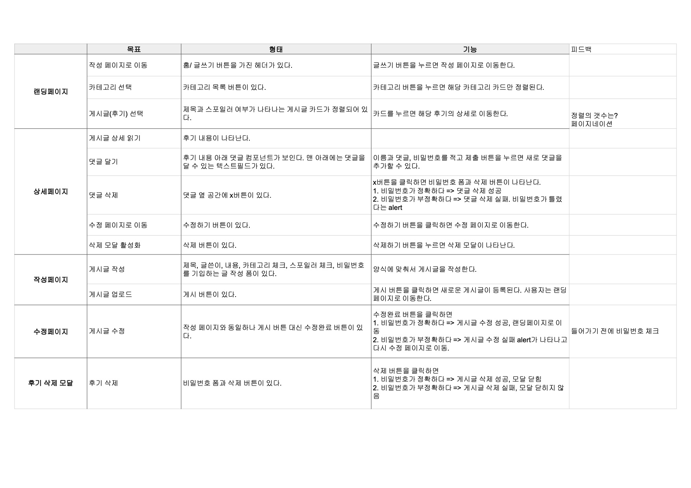

# 파일럿 프로젝트 설명서
## 프론트 사용 스펙

1. `create-react-app` typescript
2. [React hooks](https://ko.reactjs.org/docs/hooks-overview.html)
3. [React modal](http://reactcommunity.org/react-modal/)
4. [Formik](https://jaredpalmer.com/formik/)
5. node-sass
6. [react router](https://github.com/ReactTraining/react-router#readme)

## 디렉토리 구조

```javascript
.
├── README.md
├── package-lock.json
├── package.json
├── public
│   ├── favicon.png
│   ├── index.html
│   ├── manifest.json
│   ├── robots.txt
│   └── static
│       └── asset  //아이콘 등에 사용되는 파일을 가지고 있습니다.
│           ├── arrow-down.svg
│           ├── check-red.svg
│           ├── check.svg
│           ├── quotation.svg
│           ├── safe-green.svg
│           └── safe.svg
├── src
│   ├── App.css
│   ├── App.test.tsx
│   ├── App.tsx
│   ├── apiclient
│   │   └── index.ts
│   ├── components  //기능하는 최소의 단위. 컨테이너에서 사용됩니다.
│   │   ├── Button.scss
│   │   ├── Button.tsx //서비스에서 사용되는 각종 버튼은 이것을 사용
│   │   ├── Card.scss
│   │   ├── Card.tsx
│   │   ├── CardList.scss
│   │   ├── CardList.tsx
│   │   ├── CheckModal.scss
│   │   ├── CheckModal.tsx
│   │   ├── CommentForm.scss
│   │   ├── CommentForm.tsx
│   │   ├── CreateComment.scss
│   │   ├── CreateComment.tsx //코멘트를 작성합니다.
│   │   ├── Header.scss
│   │   ├── Header.tsx
│   │   ├── LinkButton.scss
│   │   ├── LinkButton.tsx
│   │   ├── Pagenation.scss
│   │   ├── Pagenation.tsx
│   │   ├── ReviewCard.scss
│   │   ├── ReviewCard.tsx
│   │   ├── ReviewForm.scss
│   │   └── ReviewForm.tsx //리뷰를 작성합니다.
│   ├── containers //페치 함수를 불러오고 상태를 관리합니다.
│   │   ├── Landing.scss
│   │   ├── Landing.tsx
│   │   ├── Post.scss
│   │   ├── Post.tsx
│   │   ├── Review.scss
│   │   ├── Review.tsx
│   │   ├── Update.scss
│   │   └── Update.tsx
│   ├── index.css
│   ├── index.tsx
│   ├── pages //url과 매치되는 부분. 컨테이너를 가져옵니다.
│   │   ├── CreateReview.tsx
│   │   ├── Detail.tsx
│   │   ├── Main.tsx
│   │   └── UpdateReview.tsx
│   ├── react-app-env.d.ts
│   ├── serviceWorker.ts
│   └── setupTests.ts
├── styles.scss
└── tsconfig.json

```


## 로컬 실행 방법
```
git clone https://github.com/limminyeong/pilot_front.git

cd pilot_front

npm i

npm start
```

## 페이지 구성

1. 유저스토리



2. 달라진 점
    * 랜딩페이지-헤더의 글쓰기 버튼은 헤더에서 분리하여 메인페이지에만 보이게 합니다. 

## 더 해보고 싶은 점

우선순위에서 밀려 구현하지 않은 점들. 시간이 있다면 추가하고 싶습니다.

1. 리뷰 데이터들 상태 관리
    * 리뷰를 수정할 때 원래 내용이 폼에 미리 들어가 있도록 하기
    * 작성중인 리뷰를 놓고 다른 페이지에 들어갔다 와도 내용 유지


## Hooks, TS 사용 경험
